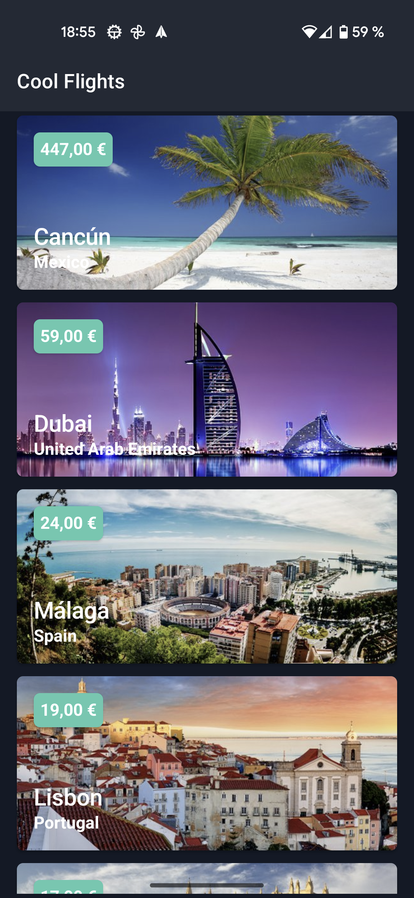
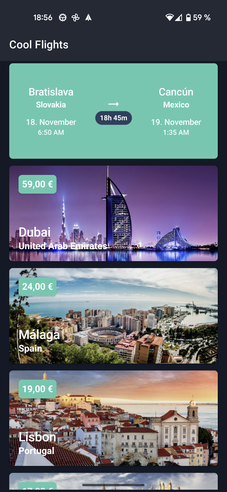
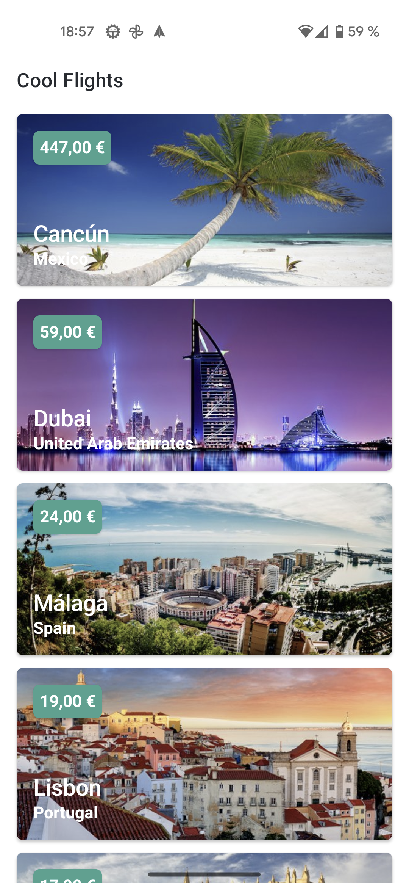
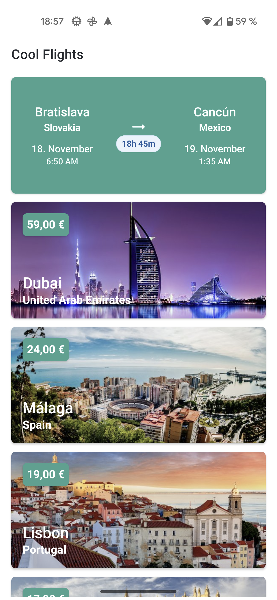

# cool-flights
Gets up to 5 popular flights every day using the api.skypicker API. The app consists on a list displaying the images of the destinations along with its price, city and country names, and if you click on one of them, the card is flipped so you can see more data of the flight.

   

### Architecture

This project is made using clean architecture with the following modules:
- **app:** contains the presentation layer, and also the Room database which belongs to the Android framework.
- **domain:** contains the use cases, our business models and the repository interface.
- **data:** contains our repository, remote and local data sources, where flights data comes from.
- **buildSrc:** the module where all the libraries and versions are defined to be used in gradle files.

### Dependencies

These are the main libraries used in this project:

- Jetpack Compose along with [Orbit Compose](https://github.com/kiwicom/orbit-compose) from [kiwi.com](https://www.kiwi.com) and accompanist for the UI
- ViewModel and LiveData for the presentation layer
- Coroutines and Flow for concurrency
- Koin for dependency injection
- Retrofit + OkHttp3 for networking
- Coil for image loading
- Room for database storage
- Junit and Mockito for testing

Kotlin DSL is used for gradle files instead of Groovy.
